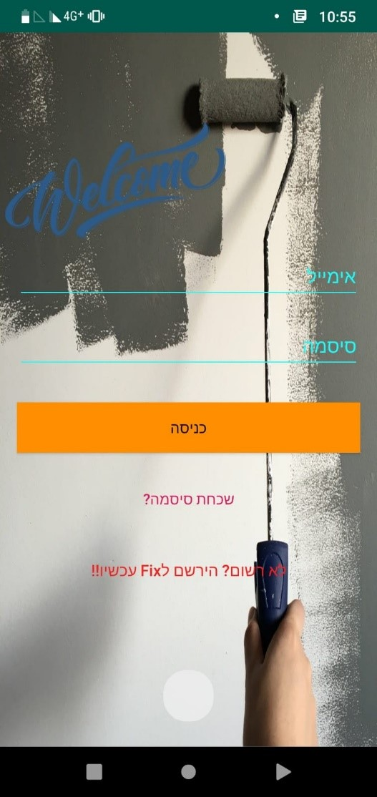

# Android-Project-Fixit-app-master
An app that lets customers and professionals coordinate based on location on maps
Submitted as part of a graduate project at Ariel University

# the project's target:
Market for small and occasional jobs. Users can post non-urgent jobs and professionals can see what jobs are around.
The proposed model is a mobile app for locating service provider services within the user's area, to help streamline this process and provide a structured approach to determining the location and quality of service provided by service providers. The app was developed on an Android operating system because of its popularity among many mobile users.

# Brief description and technical data
The system consists of a mobile app for Android system. The database is used by Firebase. The database is used to store data from both the client's mobile application and the Internet dashboard. The server is used to process requests between clients and the database.

# Database:

# Enter an application (splash)

# Login Screen

# Register Screen

# Reset passeord screen

# Main Screen (after a authorization)

 

# Customer Activity
 
 
## Perform a service call:
 
 
## If approved back to main menu:
 

# Professional Acticvity:

 
 

# Setting Acticvity:

 
 

